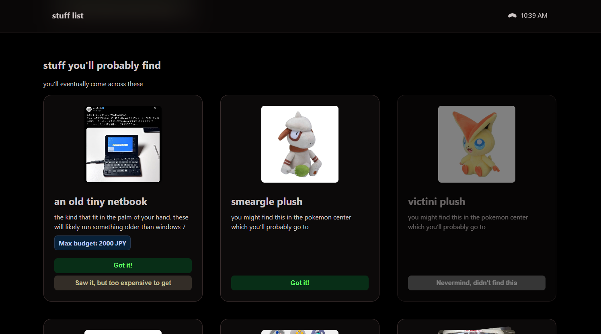

# stuff-list

a scavenger hunt list thing i quickly whipped up

i had a few friends travel to japan to i made this to have them look for stuff i would've looked for if i had also gone there. pushed to github with a few touchups and this README as a bit of writeup

made with next.js and motion and some help from gemini 2.5 pro and whatever models Cursor used for their "auto" agent during october 2026

uses firebase as a quick way to get data saving. also nicely comes with live auto updates if multiple people have the website open.



*if you go to japan, maybe you can bring these back for me too? :)*

## project setup

```bash
# clone repo
git clone https://github.com/zyplos/stuff-list.git & cd stuff-list
# install dependencies
bun i
# run dev server
bun dev
```

items are defined in `./internals/items.tsx` instead of a database as a easy quick way to set your list up. you can see what information items can have in `./internals/types.ts` or look at the existing items as examples.

nothing is saved by default. if you want your checklist to save you'll need to set up firebase. make a new firebase project and note down the config values it gives you. then go to the realtime database on the sidebar, provision your database, and copy the url.

duplicate the `.env.example` file to `.env` and fill out the list with its appropriate values.

you can find the firebase rules i used in `./firebase-rules.json`.
